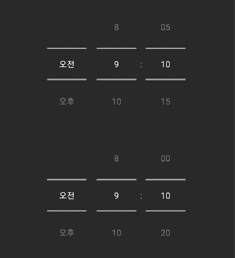

# IntervalTimePicker
IntervalTimePicker can **control interval of minutes** using TimePicker.

## Demo
- This demo control 5 minute / 10 minute interval TimePicker
</br></br>

</br></br>


## Setup

### Gradle
[](https://search.maven.org/search?q=g:%22io.github.ParkSangGwon%22%20AND%20a:%intervaltimepicker%22)

```gradle

repositories {
  google()
  mavenCentral()
}

dependencies {
    implementation 'io.github.ParkSangGwon:IntervalTimePicker:x.y.z'
    //implementation 'io.github.ParkSangGwon:IntervalTimePicker:1.0.0'
}

```

If you think this library is useful, please press star button at upside. </br>


</br></br>


## How to use
```xml
<gun0912.intervaltimepicker.IntervalTimePicker
    android:id="@+id/time_picker"
    android:layout_width="match_parent"
    android:layout_height="wrap_content"
    android:gravity="center"
    android:timePickerMode="spinner"
    app:interval="5" />
```
- You have to use `android:timePickerMode="spinner"` not `clock` (Clock mode don't need interval)

</br></br>
## License

````code
Copyright 2023 Ted Park

Licensed under the Apache License, Version 2.0 (the "License");
you may not use this file except in compliance with the License.
You may obtain a copy of the License at

http://www.apache.org/licenses/LICENSE-2.0

Unless required by applicable law or agreed to in writing, software
distributed under the License is distributed on an "AS IS" BASIS,
WITHOUT WARRANTIES OR CONDITIONS OF ANY KIND, either express or implied.
See the License for the specific language governing permissions and
limitations under the License.```
````
